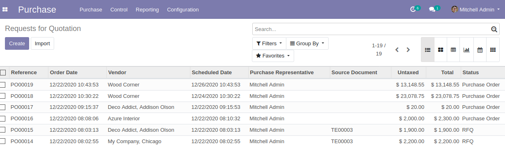
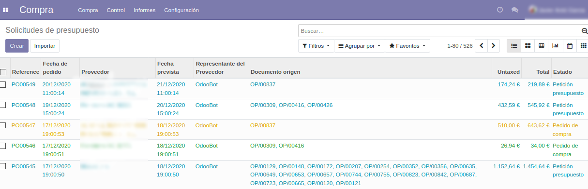

## Decorate Purchase Orders Tree

This module customizes the Purchase orders tree with different colors depending on
whether the order status. At a glance you can see Purchase orders open, canceled or
billed.

## Installation

Install as usual, copying the folder with the module to a folder within the odoo-addons
path.

## See the difference

Go to Purchase, Purchase, Purchase Orders / Requests for quotation to see the the
difference.

### Before

### After

