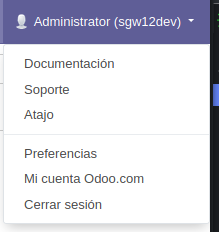
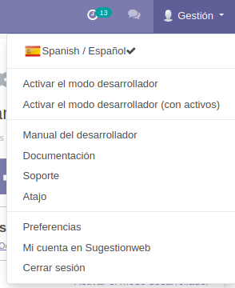

# Odoo Customize

This module makes it possible to modify the user menu and also removes the "Odoo"
trademark name in certain parts of the software.

## Installation

You can download the module from the github repository, copy it to an addons folder that
is included in the odoo path and install it like any other odoo module.

## Use

To see the options, go to **Settings**, **Sugestionweb**, **Customize Odoo**

### The module allows

#### Change the system name

Replace the string 'Odoo' with the name assigned to the system in different parts of the
software such as in the title bar of the browser or the user menu.

#### Customize User Menu / Menu Content

The default user menu includes links to the Odoo website:

You can customize it, hiding certain options as well as modifying the links, adding a
language selector, links to the development modes ...

#### Quick Data cleaning (Caution!)

Allows you to delete all orders, movements, purchase orders, invoices etc. with a single
click.

#### Others

- Remove odoo mark in the footer of the public website with the default design: Modify
  the website_templates view included in the / views / folder and adapt it to your
  convenience, then install the module, or update it if it was already there installed.

- To remove odoo mark in the footer of email messages follow these
  [instructions](https://www.javieranto.com/kb/Programaci%C3%B3n/odoo/Tips%20Administracion%20Odoo/)

# Credits

Most of this module is based on
https://github.com/guohuadeng/app-odoo/tree/13.0/app_odoo_customize and I have only
adapted it specifically for my needs.
