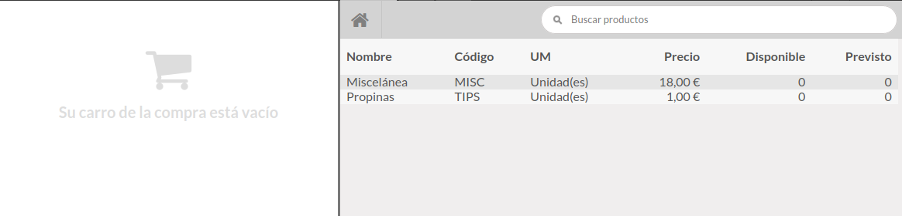

# SGW pos product list view

This module modifies the screen of the products at the point of sale to see them in list
mode, saving space and without displaying the image of the product.

## Installation

You can download the module from the github repository, copy it to an addons folder that
is included in the odoo path and install it like any other odoo module.

## Use

To see the changes go to POS, you will see the changes.
